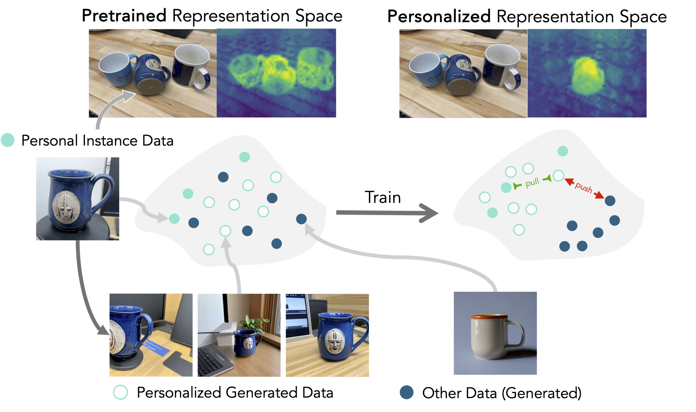

# Personalized Representation from Personalized Generation

<h3 align="center"><a href="https://personalized-rep.github.io" style="color: #E34F26;">Project page</a>&nbsp&nbsp&nbsp&nbsp&nbsp&nbsp&nbsp&nbsp&nbsp&nbsp&nbsp
  <a href="https://example2.com" style="color: #E34F26;">Paper</a>&nbsp&nbsp&nbsp&nbsp&nbsp&nbsp&nbsp&nbsp&nbsp&nbsp&nbsp
<a href="#citation" style="color: #2088FF;">Bibtex</a><br></h3>

<p align="center">
<a href="https://ssundaram21.github.io" a href="center">Shobhita Sundaram</a> <sup>1</sup> <sup>*</sup> <sup>†</sup>
<a href="https://juliachae.github.io" style="margin: 0 15px; text-decoration">Julia Chae</a> <sup>1</sup> <sup>*</sup> 
<a href="https://people.csail.mit.edu/yonglong/" style="margin: 0 15px; text-decoration">Yonglong Tian</a> <sup>2</sup> <sup>‡</sup> 
<a href="https://beerys.github.io" style="margin: 0 15px; text-decoration">Sara Beery</a> <sup>1</sup> <sup>§</sup> 
<a href="http://web.mit.edu/phillipi/" style="margin: 0 15px; text-decoration">Phillip Isola</a> <sup>1</sup> <sup>§</sup> 
<br>
<sup>1</sup> MIT, <sup>2</sup> OpenAI.
<sup>*</sup> equal contribution, <sup>§</sup> co-supervised; order by coin flip.
<br>
<sup>†</sup> work done partially as a student researcher at Google, <sup>‡</sup> work done at Google.
</p>
<br>



## Summary
**What is a personalized representation, and why do we need it?**

Adapting large vision models such as CLIP, DINO, etc to personalized tasks is difficult -- these tasks are both fine-grained and data-scarce.

A **personalized representation** is a general-purpose representation that has been specialized to a target instance, and can be flexibly applied to any downstream task involving the instance. In the same way that general representations can be applied few- or zero-shot to downstream tasks, a personalized representation of your mug (for instance) encodes knowledge about your mug and can be used to classify it, segment it, etc.

We propose a framework for learning personalized representations from as little as **three images** using synthetic data. In [our paper](#link) we show that our method improves downstream performance across diverse personalized tasks.

## Table of Contents
* [Requirements](#requirements)
* [Setup](#setup)
* [Training & Evaluating Personalized Representations](#training--evaluating-personalized-representations)
  * [Pipeline Overview](#pipeline-overview)
  * [Quickstart: Running Experiments](#quickstart-running-experiments)
  * [Training Only](#training-only)
  * [Evaluation Only](#evaluation-only)
* [Data](#data)
  * [The PODS Dataset](#the-pods-dataset)
  * [Evaluation Datasets](#evaluation-datasets)
  * [Synthetic Datasets](#synthetic-datasets)
* [Citation](#citation)

## Requirements
- Linux
- Python 3 (tested on 3.12)

## Setup
#### 1. Setup conda environment
```
conda create -n prpg python==3.12
conda activate prpg
```

#### 2. Install dependencies
```
git clone https://github.com/ssundaram21/personalized-rep
cd personalized-rep
pip install -r requirements.txt
```

#### 3. (optional) Download resources
If you are planning to use CLIP or MAE, run `models/download_models.sh` to download the checkpoints into `./cache` (DINOv2 downloads automatically when running the pipeline).

To download our evaluation datasets run `dataset/download_benchmarks.sh` and to download the best-performing synthetic datasets for each benchmark, run `dataset/download_synthetic.sh`. See the [data](#data) section for more information on datasets.

## Training & Evaluating Personalized Representations

### Pipeline Overview
The main pipeline in `contrastive/main.py` trains and evaluates personalized representations with a small real dataset and a larger synthetic dataset. It assumes you already have this data; see [Generating synthetic datasets](#generating-synthetic-datasets) for more information on how to generate synthetic data. The full pipeline executes three steps:

1. Samples $n$ triplets `(positive_1, positive_2, negative)` with positives representing the instance of interest, drawn from real and synthetic datasets.
2. Finetunes a specified pretrained ViT model on the triplets.
3. Evaluates the personalized model on global (classification, retrieval) and dense (detection, segmentation) downstream tasks.

### Quickstart: Running Experiments

See `contrastive/main.py` for a full list and description of arguments. We provide sample configs in `configs`. 

For example, to run the pipeline on class 0 of the PODS dataset, run:
```
python contrastive/main.py --config configs/run/run_pipeline_single_cls.yaml
```

You can also generate bash files to sweep over multiple classes. For example:
```
python launch/make_launch.py --config configs/run/run_pipeline_multi_cls.yaml --launchfile_name run.sh --quiet
```
This will generate a bash file `run.sh` with a bash command for each class.

### Training only
To run only the training part of the pipeline (without downstream evaluation), omit the `downstream_task` argument. The default value of `None` will skip the evaluation process.

### Evaluation only
To only run evaluation, pass an evaluation config to `downstream/run_downstream.py`. For example:
```
python downstream/run_downstream.py --config configs/run/run_eval_only_single_cls.yaml
``` 
See `downstream/run_downstream.py` for a full list/description of arguments (which are a subset of those in `contrastive/main.py`).

## Data

### The PODS Dataset
We introduce the PODS (Personal Object Discrimination Suite) dataset, a new benchmark for personalized vision tasks. For dataset details and download, see the [dataset page](https://github.com/ssundaram21/generative-synthetic/blob/release_pipeline/dataset/README.md). PODS is also on [HuggingFace](https://huggingface.co/datasets/chaenayo/PODS).

### Evaluation Datasets
To reproduce our experiments on the PODS, DF2, and/or DOGS datasets, run `dataset/download_benchmarks.sh` to download and unzip the datasets. See the [dataset page](https://github.com/ssundaram21/generative-synthetic/blob/release_pipeline/dataset/README.md) for more details on dataset structure/creation, and how to set up your own dataset.

### Synthetic datasets
We train personalized representations by augmenting real datasets of personal instances with generated synthetic datasets. To download/unzip sample synthetic positive and negative datasets, run `dataset/download_synthetic.sh`.

For a full list of synthetic datasets and download links, see our [dataset page](https://github.com/ssundaram21/generative-synthetic/blob/release_pipeline/dataset/README.md).

#### Generating synthetic datasets
Scripts for finetuning DreamBooth and generating synthetic data are in the `generation` directory.

First, download extra dependencies with `pip install -r generation/generation_requirements.txt`.

Then, you can run the following. See the corresponding bash scripts in `configs/run` for default arguments, and the `argparse` in each python script for a description of each argument:
* To train DreamBooth: `python generation/train_dreambooth.py <dreambooth arguments>`
* To train DreamBooth with masks: `python generation/train_dreambooth_mask.py <dreambooth arguments + mask-specific arguments>`
* To generate data from a DreamBooth checkpoint: `python generation/generate_data.py <generation arguments>`
* To generate data from a DreamBooth checkpoint with filtering: `python generate_data.py <generation arguments + mask-specific arguments>`

## Citation
If you find our work or any of our materials useful, please cite our paper:
```
@article{sundaram2024personalized,
  title   = {Personalized Representation from Personalized Generation}
  author  = {Sundaram, Shobhita and Chae, Julia and Tian, Yonglong and Beery, Sara and Isola, Phillip},
  journal = {Arxiv},
  year    = {2024},
}
```
            
